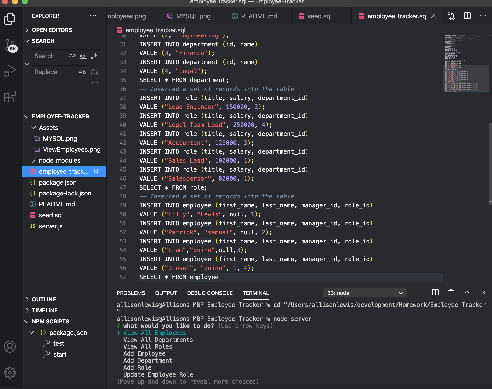
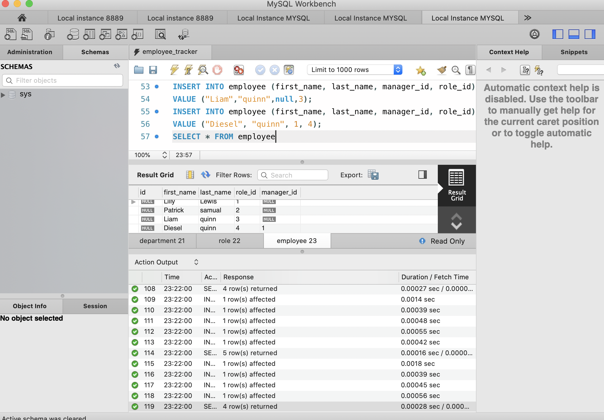
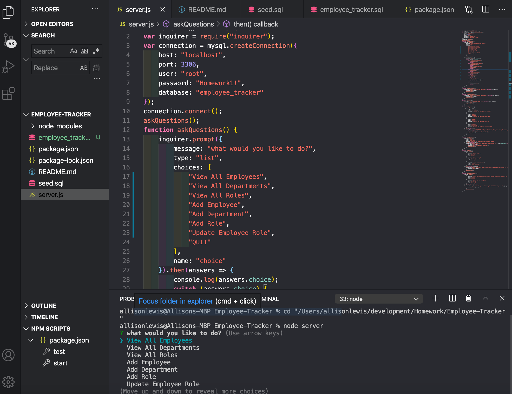

# Employee-Tracker

## Instructions

This app was designed to help manage companies, employees using node, inquirer, and MySQL.
the following database schema contains three tables:
 * Add departments, roles, employees

  * View departments, roles, employees

  * Update employee roles

  * Updates employee managers

  * Views employees by manager

  * Delete departments, roles, and employees

* The command-line application should also allow users to:

  * Add departments, roles, employees

  * View departments, roles, employees

  * Update employee roles

* The command-line application should also allow users to:

  * Update employee managers

  * View employees by manager

  * Delete departments, roles, and employees

  * View the total utilized budget of a department -- ie the combined salaries of all employees in that department
## Here are examples of the app:

## Link to video of project:
https://drive.google.com/file/d/1nlJ58n7W4m98vSEzzq44AoT7IxZSwNNC/view
